# social-website-project
Welcome to Bookmarks, a sophisticated social website designed to provide a seamless user experience. With a focus on user engagement and efficiency.

**Book Reference:** [Django 4 by Example](https://www.packtpub.com/product/django-4-by-example-fourth-edition/9781801813051)

The book offers professionals level projects with detailed explanations, making it an invaluable resource for building robust Django applications.

# Screenshots

### 1. Dashboard
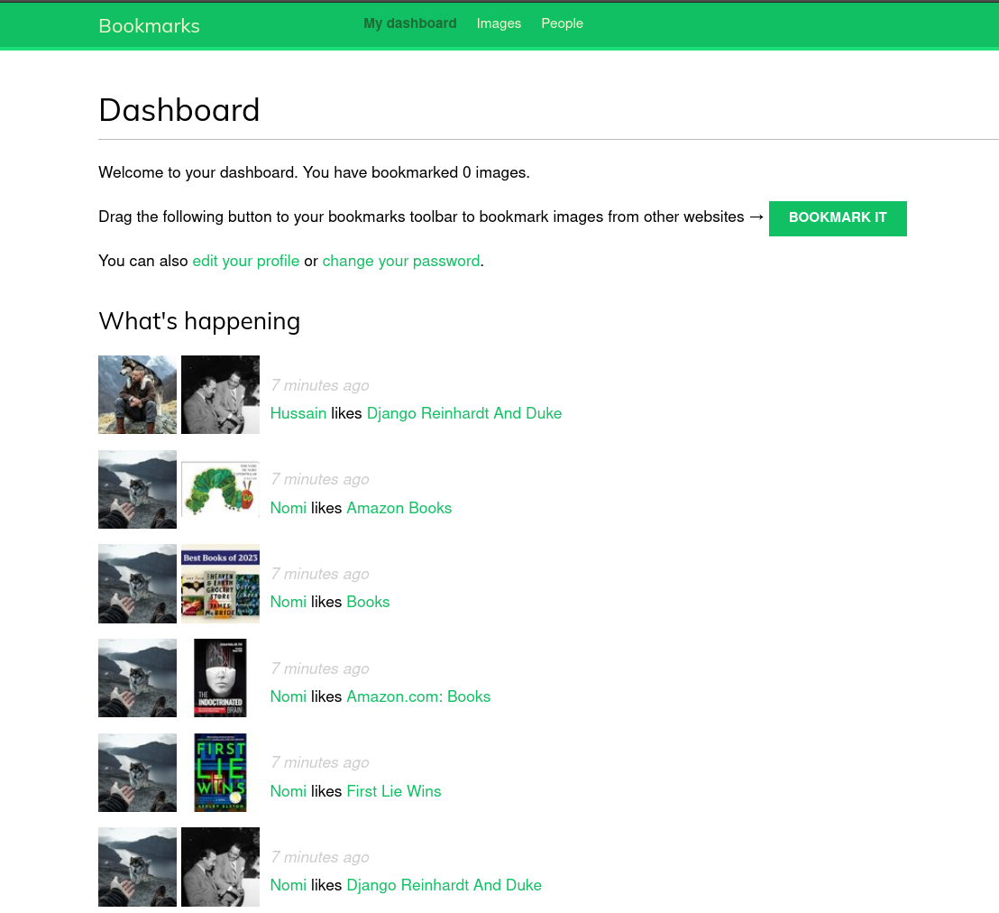
- **Mastering Web Development:**
  - Build a bookmarklet with JavaScript.
  - Implement asynchronous actions.
  - Add infinite scroll pagination to image lists.
  - Create many-to-many relationships with an intermediary model.
  - Enable user follow/unfollow actions with JavaScript.
  - Develop a generic activity stream application.
  - Avoid duplicate actions in the activity stream.
  - Optimize with `select_related()` and signals for denormalizing counts.

### 2. Debug Panel
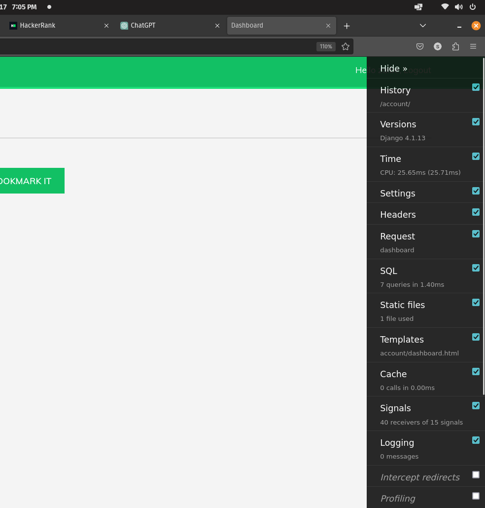
- **Optimize Debugging:**
  - Utilize Django Debug Toolbar panels.
  - Execute Django Debug Toolbar commands for a streamlined debugging experience.

### 3. Debug Signals
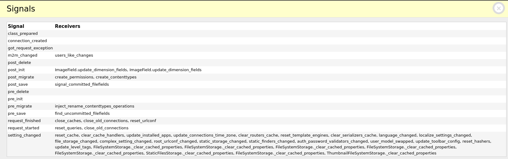
- **Enhanced Debugging with Signals:**
  - Utilize Django signals for efficient debugging and application optimization.

### 4. Debug Time
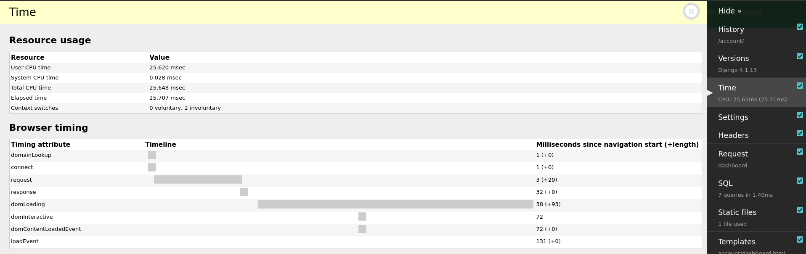
- **Time Analysis with Debug Time:**
  - Utilize Django Debug Toolbar to analyze and optimize your application's execution time.

### 5. Follow Actions
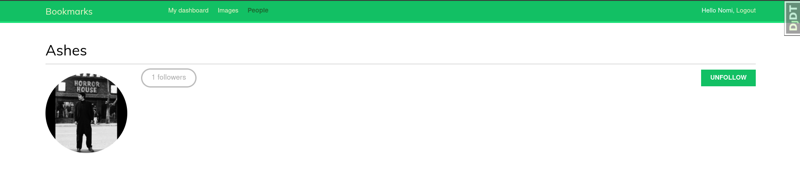
- **User Engagement:**
  - Explore user follow/unfollow actions and build a more engaging platform.

### 6. Login With
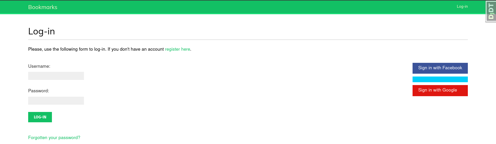
- **Efficient Authentication:**
  - Implement secure login mechanisms for enhanced user authentication.

### 7. People Directory
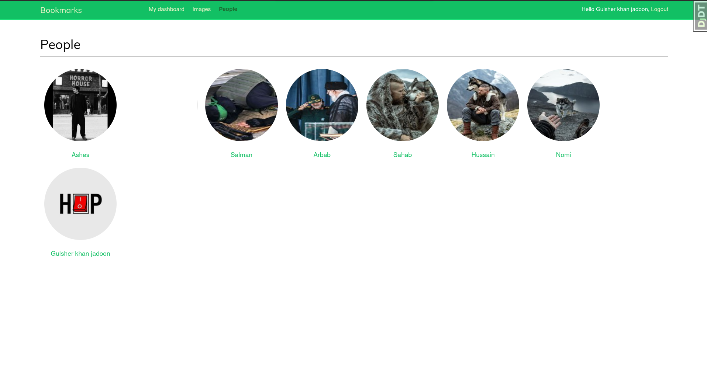
- **User Directory:**
  - Navigate through a comprehensive people directory to discover and connect with users.

### 8. User Profile
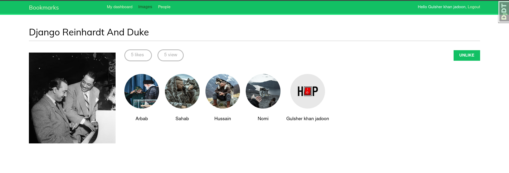
- **Personalized User Profiles:**
  - Customize and view user profiles to enhance the personalization of your experience.

### 9. User Profiles
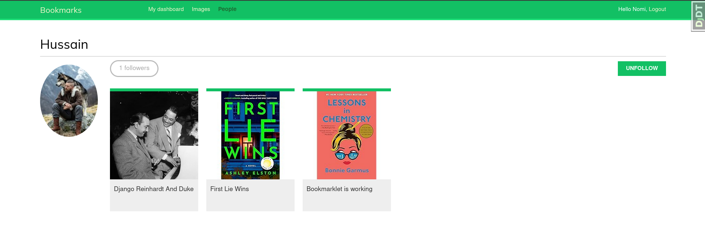
- **Discover Diverse User Profiles:**
  - Explore various user profiles to connect and engage with a diverse community.

### 10. Password Reset
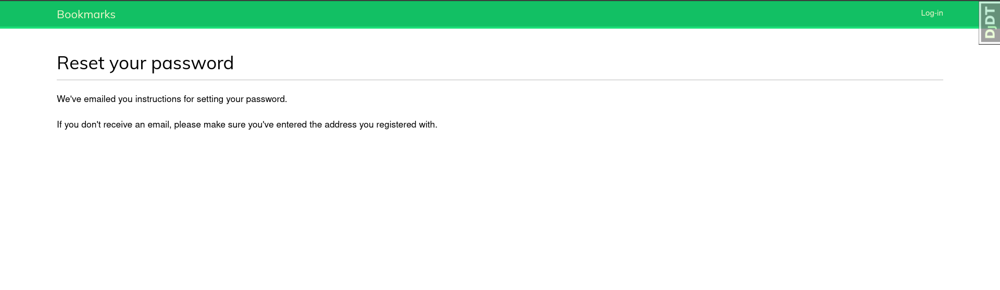
- **Seamless Password Recovery:**
  - Easily reset your password through a secure and user-friendly email verification process.

### 11. Welcome
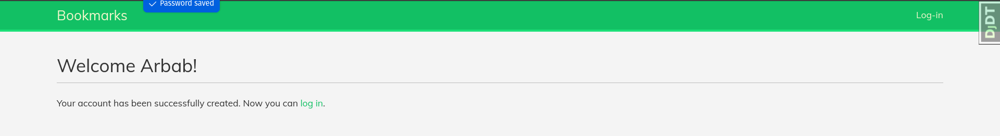
- **Personalized Welcome Experience:**
  - Receive a warm and personalized welcome upon logging in to your account.
